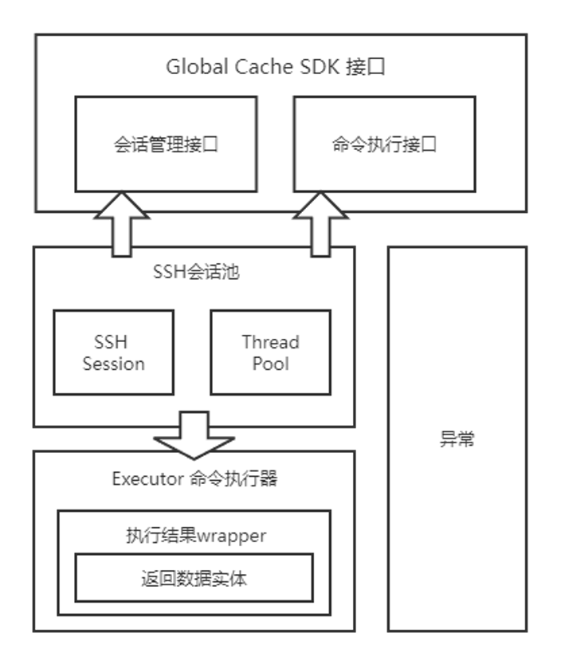
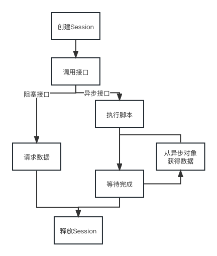

# Global Cache SDK

## 概述

​	Global Cache集群可视化软件数据接口（Global Cache SDK），其使用Shell脚本对集群查询数据命令进行封装，使用SSH协议对Web后端服务和集群数据传输进行加密，使用Java对查询数据脚本和自动化部署脚本调用进行封装，以Jar包形式为Web后端服务提供数据获取接口。

## 快速上手

* Global Cache SDK 使用者请参考<a href=#usage>使用</a>部分内容；
* Global Cache SDK 开发者请参考<a href=#develop>开发</a>部分内容。

## 特性

* **自动并发**：对于需要在多个节点上执行的命令，使用内部线程池将其转变为多个节点并发执行。
* **易配置**：用户可以使用XML文件对接口进行配置，同时也可以调用辅助配置接口在运行时动态修改接口配置。
* **易拓展**：接口的集成进行了依赖倒转，接口开发者只需要完成输入参数的处理的返回数据的解析，无需关注接口实例化和接口并发细节。
* **异步请求**：对于耗时较长的请求，通过异步防止阻塞当前线程，并支持从异步实体获取实时输出。



## <span id=usage>使用</span>

使用者调用Global Cache SDK的接口调用的主要流程如下：



### 同步接口调用

​	由于数据请求接口调用时间较短，因此将其设计为阻塞调用，即调用完函数即可获得输出。接下来以调用CPU信息请求接口为例，演示如何调用阻塞接口：

#### Step1：查看接口配置文件

​	查看`resource/configure`目录下对应接口的XML文件，并将其拷贝到项目中的`resource/configure`目录下（否则会出现**未知配置文件**的错误）。

接口配置文件格式说明如下：

```xml
<?xml version="1.0" encoding="utf-8" ?>
<description>
    <name>QueryCpuInfo</name>        // 命令名称（Java类名）
    <async>false</async>             // 是否为异步命令
    <args>false</args>               // 是否为带参命令
    <execute>ALL_NODES</execute>     // 命令执行节点
    <privilege>USER</privilege>      // 命令执行权限
    <timeout>2</timeout>             // 命令请求等待时间，单位：秒
    <comment>获取节点CPU信息</comment> // 备注
</description>
```

​	调用者只需要关注`execute`，`privilege`和`timeout`这三个值。

* 调用`createSession`传入的`host`需要参照`execute`；
* 传入的`user`需要参照`privilege`；
* 其中`timeout`是接口内部执行的SSH命令的**硬超时时间**（为了防止由于网络问题导致的长时间阻塞），超过该时间，对应节点的请求数据一定为`null`。

**tips**：有些时候由于网络连接不稳定，可能会出现接口调用超时，调用者可以调用`setCommandTimeout`**动态的调整接口的超时时间**。

#### Step2: 创建Session

​	根据接口配置文件，调用`createSession`创建Session，由于`execute`的值为`ALL_NODES`，所以需要添加集群所有的节点；由于`privilege`的值为`USER`，所以需要添加`globalcachesdk`用户。

​	可以通过调用`enumExecutePrivilegeName`函数或者权限下对应的用户名。

**tips**：由于创建Session时间较长，因此不建议重复调用，可以一次性创建全部需要的Session，多个调用接口进行Session的复用。

```java
public static void queryCpuInfoDemo() {
  ...

  ArrayList<String> hosts = new ArrayList<>();
  hosts.add("175.34.8.36");
  hosts.add("175.34.8.37");
  hosts.add("175.34.8.38");
  hosts.add("175.34.8.39");

  ArrayList<String> users = new ArrayList<>();
  users.add("globalcachesdk");
  users.add("globalcachesdk");
  users.add("globalcachesdk");
  users.add("globalcachesdk");

  ArrayList<String> passwords = new ArrayList<>();
  passwords.add("globalcachesdk");
  passwords.add("globalcachesdk");
  passwords.add("globalcachesdk");
  passwords.add("globalcachesdk");

  for (int i = 0;i < hosts.size(); i++) {
    try {
      GlobalCacheSDK.createSession(hosts.get(i), users.get(i), passwords.get(i), 22);
      System.out.println(hosts.get(i) + " SSH会话创建成功");
    } catch (GlobalCacheSDKException e) {
      System.out.println(hosts.get(i) + " SSH会话创建失败");
      e.printStackTrace();
    }
  }
  ...
}
```

#### Step3：调用接口

调用对应的接口，所有接口的返回结果为`Map<String, CommandExecuteResult>`，其中`String`为命令执行节点，`CommandExecuteResult`为节点执行结果。当`CommandExecuteResult.getStatusCode`为`StatusCode.SUCCESS`时表示接口调用成功；接口调用失败时，`CommandExecuteResult.getData`的结果为**未定义**。

```java
public static void queryCpuInfoDemo() {
  ...
  Map<String, CpuInfo> nodesCpuInfoHashMap = new HashMap<>(hosts.size());
  try {
    for (Map.Entry<String, CommandExecuteResult> entry : GlobalCacheSDK.queryCpuInfo(hosts).entrySet()) {
      if (entry.getValue().getStatusCode() == StatusCode.SUCCESS) {
        nodesCpuInfoHashMap.put(entry.getKey(), (CpuInfo) entry.getValue().getData());
      }
    }
  } catch (GlobalCacheSDKException e) {
    System.out.println("接口调用失败");
    e.printStackTrace();
  }
  ...
}
```

#### Step4: 释放Session

当不需要进行接口请求时，可以调用`releaseSession`时释放Session。

```java
public static void queryCpuInfoDemo() {
  ...
  for (String host : hosts) {
  try {
 			GlobalCacheSDK.releaseSession(host, "globalcachesdk");
      System.out.println(host + " SSH会话释放成功");
    } catch (GlobalCacheSDKException e) {
      System.out.println(host + " SSH会话释放失败");
      e.printStackTrace();
    }
  }
  ...
}
```

### 异步接口调用

​	由于自动化部署调用时间较长，因此将其设计为非阻塞调用，其返回一个异步实体，可以从异步实体中获得实时输出。由于异步接口获取到的是原始输出，如果需要检测命令是否执行成功，需要与对应的阻塞调用接口搭配使用。

​	异步接口调用除**Step3：调用接口**，其他步骤均与同步接口相同，在此不在赘述。

#### Step1：查看接口配置文件

参考同步接口调用

#### Step2：创建Session

参考同步接口调用

#### Step3：调用接口

调用对应的接口，所有接口的返回结果为`Map<String, CommandExecuteResult>`，其中`String`为命令执行节点，`CommandExecuteResult`为节点执行结果。当`CommandExecuteResult.getStatusCode`为`StatusCode.SUCCESS`时表示接口调用成功；接口调用失败时，`CommandExecuteResult.getData`的结果为**未定义**。

```java
public static void gcServiceControlDemo() {
    ...
    Map<String, AsyncEntity> entityMap = new HashMap<>(hosts.size());
    try {
	for (Map.Entry<String, CommandExecuteResult> entry : GlobalCacheSDK.gcServiceControl(hosts, "restart").entrySet()) {
	    if (entry.getValue().getStatusCode() == StatusCode.SUCCESS) {
		entityMap.put(entry.getKey(), (AsyncEntity) entry.getValue().getData());
	    } else {
		System.out.println("接口调用失败");
	    }
        }
    } catch (GlobalCacheSDKException e) {
	System.out.println("接口调用失败");
	e.printStackTrace();
    }
    ...
}
```

调用所有的异步接口统一返回一个**AsyncEntity对象**，可以调用**readLine方法**从该对象中获取命令的输出。其中，有**实时读取**和**阻塞读取**两种读取方法。

实时读取示例如下：

```java
public static void gcServiceControlDemo() {
    ...
    // Example1：获取实时输出
    // 以查看175.34.8.36的接口的输出为例
    AsyncEntity entity = entityMap.get("175.34.8.36");
    while (true) {
	try {
	    String line = entity.readLine();
	    if (line == null) {
	        // 结果读取完毕
		break;
	    }
	    System.out.println(line);
	} catch (AsyncThreadException e) {
	    System.err.println("异步线程异常");
	    break;
	}
    }
    entity.waitFinish(); // 此时线程已经读取完毕，关闭缓冲区和Channel
    ...
}
```

阻塞读取示例如下：

```java
public static void gcServiceControlDemo() {
    ...
    // Example2：一次性读取全部输出
    // 以查看175.34.8.36的接口的输出为例
    entity.waitFinish(); // 阻塞当前线程，等待异步线程执行完毕
    while (true) {
        try {
	    String line = entity.readLine();
	    if (line == null) {
	        // 结果读取完毕
	        break;
	    }
	    System.out.println(line);
        } catch (AsyncThreadException e) {
            System.err.println("异步线程异常");
            break;
        }
    }
    ...
}
```

使用实时读取可以对读取完的数据进行处理（例如：发送给前端）后再调用**readLine**，因此，建议优先使用实时读取的方式获取脚本输出。

**注意：** waitFinish将会结束异步线程和关闭Channel，因此**该函数仅能调用一次**。

#### Step4：释放Session

参考同步接口调用

## <span id=develop>开发</span>

Global Cache SDK项目目录结构如下：

```bash
src
└── main
    ├── java
    │   └── com
    │       └── example
    │           └── globalcachesdk
    │               ├── entity       # 命令返回结果实体
    │               ├── exception
    │               ├── executor
    │               ├── executorImpl # 命令执行与解析具体实现
    │               ├── pool
    │               └── utils
    └── resources
        └── configure # 接口配置文件
```

接口配置文件格式说明如下：

```xml
<?xml version="1.0" encoding="utf-8" ?>
<description>
    <name>QueryCpuInfo</name>        // 命令名称（Java类名）
    <async>false</async>             // 是否为异步命令
    <args>false</args>               // 是否为带参命令
    <execute>ALL_NODES</execute>     // 命令执行节点
    <privilege>USER</privilege>      // 命令执行权限
    <timeout>2</timeout>             // 命令请求等待时间，单位：秒
    <comment>获取节点CPU信息</comment> // 备注
</description>
```

### 同步接口开发

​	由于数据请求接口调用时间较短，因此将其设计为阻塞调用，即调用完函数即可获得输出。接下来以调用CPU信息请求接口为例，演示如何开发阻塞接口：

#### Step1：抽象结果实体

​	根据需求，对Shell脚本返回的命令进行抽象，在`entity`目录下创建一个`CpuInfo`的类，**该类继承自`AbstractEntity`**，并实现对应的`getter/setter`方法。

```java
public class CpuInfo extends AbstractEntity {

    private double totalUsage;

    private ArrayList<Double> coreUsage;

    public double getTotalUsage() {
        return totalUsage;
    }

    public void setTotalUsage(double totalUsage) {
        this.totalUsage = totalUsage;
    }

    public ArrayList<Double> getCoreUsage() {
        return coreUsage;
    }

    public void setCoreUsage(ArrayList<Double> coreUsage) {
        this.coreUsage = coreUsage;
    }
}

```

#### Step2：实现命令执行类代码

​	在`executorImpl`目录下创建一个`QueryCpuInfo`类，**该类继承自`AbstractCommandExecutorSync`**，在子类中，需要**实现子类的构造函数**，**重写父类的`parseOf`方法**。

​	子类构造函数**必须通过`super`调用父类的构造函数**，参数必须为`子类名.class`，以便父类能够通过子类名称，根据XML配置文件反转生成命令的配置。

​	在`parseOf`中需要实现对**命令原始返回值结果的装箱**

```java
...
public class QueryCpuInfo extends AbstractCommandExecutor {

    /**
     * 节点CPU信息正则表达式
     */
    private static final Pattern CPU_INFO_PATTERN = Pattern.compile("\\d+\\.\\d+");

    public QueryCpuInfo() {
        super(QueryCpuInfo.class);
    }

    @Override
    public AbstractEntity parseOf(String returnValue) throws ReturnValueParseException {
        Matcher matcher = CPU_INFO_PATTERN.matcher(returnValue);
        CpuInfo cpuInfo = new CpuInfo();

        // 整体核心利用率
        if (matcher.find()) {
            cpuInfo.setTotalUsage(100 - Double.parseDouble(matcher.group(0)));
        }

        // 每个逻辑核心的利用率
        ArrayList<Double> coreUsage = new ArrayList<>();
        while (matcher.find()) {
            coreUsage.add(100 - Double.parseDouble(matcher.group(0)));
        }
        cpuInfo.setCoreUsage(coreUsage);

        return cpuInfo;
    }
}
...
```

#### Step3：添加注解

​	在`resources/configure`目录下创建一个`QueryCpuInfo.xml`文件，**建议该文件名与接口名称一致**。该文件描述了与命令执行有关的信息（**注意：配置文件内容需要根据需求文档进行编写**），文件内容如下：

```xml
<?xml version="1.0" encoding="utf-8" ?>
<description>
    <name>QueryCpuInfo</name>
    <async>false</async>
    <args>false</args>
    <execute>ALL_NODES</execute>
    <privilege>USER</privilege>
    <timeout>2</timeout>
    <comment>获取节点CPU信息</comment>
</description>
```

​	在`QueryCpuInfo`类中添加`@Configure`注解，注解参数`path`为XML文件的相对路径。此时，该命令执行类的默认配置和对应的XML文件已经进行了映射，可以通过修改XML文件实现修改命令执行类的默认配置。

在`QueryCpuInfo`类中添加`@Script`注解，注解参数`path`为远程Shell脚本的绝对路径。`prefixCommand`为前缀命令，`suffixCommand`为后缀命令，默认均为空。
此时，在`SSHSessionPool`中会自动执行SSH请求，并获取返回结果。其中执行的Shell命令格式为:

```bash
<prefixCommand> bash <path> <suffixCommand>
```

```java
...
@Configure(path= "/configure/QueryCpuInfo.xml")
@Script(path = "<remote shell script path>", prefixCommnad=, suffixCommnad=)
public class QueryCpuInfo extends AbstractCommandExecutorSync {
...
}
...
```

#### Step4：注册命令执行类

​	在`RegisterExecutor.java`中，添加一个名为`QUERY_CPU_INFO`的枚举值，**枚举值为命令执行类的名称的大写下划线格式**，并为该枚举值添加`@Registry`注解。

**注意：`CommandExecutorFactory`内部通过枚举值反转生成对应的命令执行类，如果名称不一致则找不到相应的命令执行类**

```java
public enum RegisterExecutor {
    ...
    @Registry
    QUERY_CPU_INFO,
    ...
}
```

#### Step5：实现接口

​	在`GlobalCacheSDK.java`中，添加对应的**静态方法**且**方法必须使用public修饰**，方法的参数根据需求拟定，返回值默认为`HashMap<String, CommandExecuteResult>`。

​	在该方法中需要完成以下3个工作：

* 调用`CommandExecutorFactory.getCommandExecutor`，根据对应的`RegisterExecutor`获得相应的executor实例
* 对于带参命令，将参数按照指定规则拼接为字符串
* 调用`SSHSessionPool.execute`让内部线程池并发执行executor

```java
...
public static HashMap<String, CommandExecuteResult> queryCpuInfo(ArrayList<String> hosts) throws GlobalCacheSDKException {
  // step1 根据"SupportedCommand.QUERY_CPU_INFO"获得QueryCpuInfo的
  AbstractCommandExecutor executor = getInstance().commandExecutorFactory.getCommandExecutor(SupportedCommand.QUERY_CPU_INFO);
  try {
      ArrayList<String> users = new ArrayList<>(hosts.size());
      String user = Utils.enumExecutePrivilegeName(executor.getDes().getExecutePrivilege());
      for (String host : hosts) {
    	  users.add(user);
      }
      // step3 调用"SSHSessionPool.execute"让内部线程池并发执行QueryCpuInfo的exec方法
      return getInstance().sshSessionPool.execute(hosts, users, executor);
  } catch (SSHSessionPoolException e) {
      throw new GlobalCacheSDKException("SSH会话池异常", e);
  }
}
...
```

### 异步接口开发

​	由于自动化部署调用时间较长，因此将其设计为非阻塞调用，其返回一个异步实体，可以从异步实体中获得实时输出。由于异步接口获取到的是原始输出，如果需要检测命令是否执行成功，需要与开发对应的同步接口。接下来以开发`GlobalCacheServiceControl`接口为例，演示如何开发异步接口：

#### Step1：实现命令执行类代码

​	在`executorImpl`目录下创建一个`QueryCpuInfo`类，**该类继承自`AbstractCommandExecutorAsync`**，子类构造函数**必须通过`super`调用父类的构造函数**，参数必须为`子类名.class`，以便父类能够通过子类名称，根据XML配置文件反转生成命令的配置。

```java
...
public class GlobalCacheServiceControl extends AbstractCommandExecutorAsync {

    public GlobalCacheServiceControl() {
        super(GlobalCacheServiceControl.class);
    }
}
...
```

#### Step2：添加注解

​	在`resources/configure`目录下创建一个`GlobalCacheServiceControl.xml`文件，**建议该文件名与接口名称一致**。该文件描述了与命令执行有关的信息（**注意：配置文件内容需要根据需求文档进行编写**），文件内容如下：

```xml
<?xml version="1.0" encoding="utf-8" ?>
<description>
    <name>GlobalCacheServiceControl</name>
    <async>true</async>
    <args>true</args>
    <execute>ALL_CEPH_NODES</execute>
    <privilege>ROOT</privilege>
    <timeout>5</timeout>
    <comment>控制GlobalCache服务</comment>
</description>
```

​	在`GlobalCacheServiceControl`类中添加`@Configure`注解，注解参数`path`为XML文件的相对路径。此时，该命令执行类的默认配置和对应的XML文件已经进行了映射，可以通过修改XML文件实现修改命令执行类的默认配置。

​	在`GlobalCacheServiceControl`类中添加`@Script`注解，注解参数`path`为远程Shell脚本的绝对路径。`prefixCommand`为前缀命令，`suffixCommand`为后缀命令，默认均为空。
此时，在`SSHSessionPool`中会自动执行SSH请求，并获取返回结果。其中执行的Shell命令格式为:

```bash
<prefixCommand> bash <path> <suffixCommand>
```

```java
...
@Configure(path = "/configure/GlobalCacheServiceControl.xml")
@Script(path = "<remote shell script path>", prefixCommnad=, suffixCommnad=)
public class GlobalCacheServiceControl extends AbstractCommandExecutorAsync {
    public GlobalCacheServiceControl() {
        super(GlobalCacheServiceControl.class);
    }
}
```

#### Step3：注册命令执行类

参考同步接口开发

#### Step4：实现接口

参考同步接口开发
